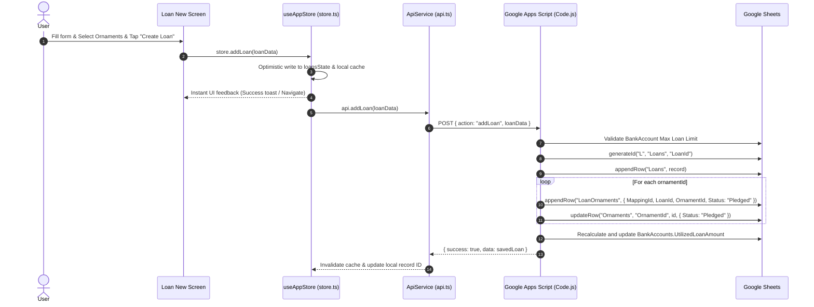
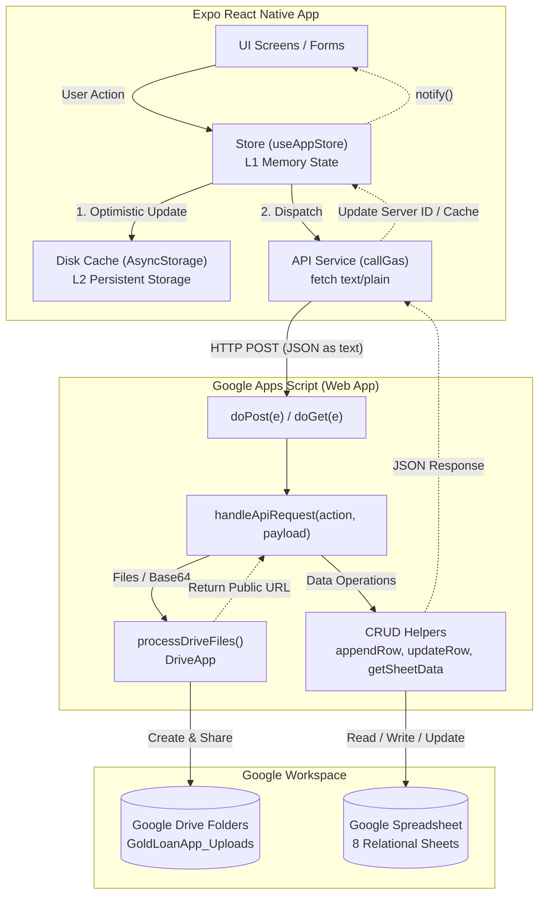

# 📐 Architecture & CRUD Flow: Expo to Google Sheets

This document details the complete end-to-end architecture, communication protocol, caching strategy, and CRUD data flow connecting the **Expo (React Native)** mobile application to **Google Sheets** (database) and **Google Drive** (blob storage) via **Google Apps Script (GAS)**.

---

## 📑 Table of Contents

1. [System Architecture Overview](#1-system-architecture-overview)
2. [Connection Bridge: Expo to Google Apps Script](#2-connection-bridge-expo-to-google-apps-script)
   - [Configuration & Dynamic Endpoints](#configuration--dynamic-endpoints)
   - [HTTP Transport & CORS Bypass Technique](#http-transport--cors-bypass-technique)
   - [Image & File Upload Pipeline](#image--file-upload-pipeline)
3. [Client-Side State & Caching Architecture](#3-client-side-state--caching-architecture)
   - [Two-Tier Caching Flow](#two-tier-caching-flow)
   - [Optimistic Updates](#optimistic-updates)
4. [Backend: Google Apps Script & Google Sheets Structure](#4-backend-google-apps-script--google-sheets-structure)
   - [Sheet Schema & Relational Model](#sheet-schema--relational-model)
   - [Core GAS Database Helpers](#core-gas-database-helpers)
5. [End-to-End CRUD Flow Traces](#5-end-to-end-crud-flow-traces)
   - [Create (C): Example - Add Loan & Pledge Ornaments](#create-c-example---add-loan--pledge-ornaments)
   - [Read (R): Example - Initial Unified Sync](#read-r-example---initial-unified-sync)
   - [Update (U): Example - Loan Closure & Ornament Release](#update-u-example---loan-closure--ornament-release)
   - [Delete (D): Example - Soft Deletion](#delete-d-example---soft-deletion)
6. [Complete Flow Diagram](#6-complete-flow-diagram)
7. [API Action Reference](#7-api-action-reference)

---

## 1. System Architecture Overview

```
┌────────────────────────────────────────────────────────┐
│                   Expo App (Frontend)                  │
│  React Native UI Screens  ──►  useAppStore (store.ts)  │
│                                       │                │
│                           api.ts (callGas HTTP)        │
└───────────────────────────────────┬────────────────────┘
                                    │ HTTP POST (text/plain JSON)
                                    ▼
┌────────────────────────────────────────────────────────┐
│         Google Apps Script (API & Business Logic)      │
│     doPost(e) / doGet(e)  ──►  handleApiRequest()       │
│                                       │                │
│    Business Logic (Auth, Validation, Drive Uploads)    │
└───────────────────┬───────────────────────────┬────────┘
                    │ DriveApp API              │ SpreadsheetApp API
                    ▼                           ▼
┌───────────────────────────────┐ ┌──────────────────────┐
│  Google Drive (Blob Storage)  │ │ Google Sheets (DB)   │
│  - Customer Photos            │ │ - Users              │
│  - Passbook Images            │ │ - BankAccounts       │
│  - Ornament Images            │ │ - Ornaments          │
│  - Delivery Proofs            │ │ - Loans              │
│                               │ │ - LoanOrnaments      │
│                               │ │ - Payments           │
│                               │ │ - Releases           │
│                               │ │ - Admins             │
└───────────────────────────────┘ └──────────────────────┘
```

The system is organized into three primary layers:
1. **Frontend (Expo / React Native)**: Mobile and web user interface with local offline cache and optimistic UI mutations.
2. **Serverless Middleware (Google Apps Script Web App)**: Exposes a single HTTP endpoint, handles JSON payloads, manages validation, generates unique IDs, and interacts with Google Workspace APIs.
3. **Database & Storage (Google Workspace)**:
   - **Google Sheets**: Relational tables storing structured business records.
   - **Google Drive**: Unstructured file storage (photos, documents, signatures).

---

## 2. Connection Bridge: Expo to Google Apps Script

### Configuration & Dynamic Endpoints

The connection is configured in `src/config/env.ts` and managed dynamically by `src/config/api.ts`:

- **Environment Default**: Reads `process.env.EXPO_PUBLIC_GAS_API_URL`.
- **Runtime Override**: The user can change the Apps Script URL inside the app Settings screen; this value is stored in `AsyncStorage` (`@goldloan_custom_gas_url`) and takes precedence without rebuilding the app.

### HTTP Transport & CORS Bypass Technique

Standard Google Apps Script Web Apps have a known limitation: they do not support HTTP `OPTIONS` preflight requests, which browsers and webviews enforce when using `fetch()` with `Content-Type: application/json`.

To solve this, `src/services/api.ts` implements `callGas()`:
- **Header**: Uses `'Content-Type': 'text/plain;charset=utf-8'`.
- **Payload**: Passes a stringified JSON object containing `{ action, ...payload }`.
- **Result**: The browser/device treats this as a simple request (no CORS preflight). Google Apps Script receives the raw text via `e.postData.contents`, which is then parsed with `JSON.parse()`.

```typescript
// src/services/api.ts
response = await fetch(baseUrl, {
  method: 'POST',
  headers: {
    'Content-Type': 'text/plain;charset=utf-8',
  },
  body: JSON.stringify({ action, ...payload }),
});
```

### Image & File Upload Pipeline

Direct binary multi-part uploads to Google Apps Script are error-prone. The app uses Base64 serialization:
1. **Selection**: User picks an image with `expo-image-picker` via `ImagePickerField.tsx`.
2. **Encoding**: The image is read into a Base64 string:
   ```json
   { "name": "photo.jpg", "mimeType": "image/jpeg", "base64": "..." }
   ```
3. **Upload to Drive**: Google Apps Script's `processDriveFiles()`:
   - Uses `Utilities.base64Decode()` and `Utilities.newBlob()`.
   - Locates or creates the folder: `Google Drive > GoldLoanApp_Uploads > [Subfolder]`.
   - Sets sharing permission to `DriveApp.Access.ANYONE_WITH_LINK`.
   - Returns the direct public file URL.
4. **Sheet Storage**: The Google Drive URL is saved into the corresponding column (`CustomerPhoto`, `OrnamentImages`, `PassbookImage`, etc.).
5. **Display in Mobile**: `getDriveDirectImageUrl()` in `src/services/api.ts` converts the Drive link into a direct thumbnail URL (`https://drive.google.com/thumbnail?id=${fileId}&sz=w1000`) for high-performance rendering in `expo-image`.

---

## 3. Client-Side State & Caching Architecture

### Two-Tier Caching Flow

The app guarantees zero UI delay through two caching layers:
1. **L1 (In-Memory)**: Global JavaScript state arrays (`usersState`, `loansState`, `ornamentsState`, etc.) in `src/services/store.ts`. Screen navigation and tab changes are instantaneous (0ms latency).
2. **L2 (Persistent Disk)**: `src/services/cache.ts` stores serialized state in `AsyncStorage` with custom TTLs.

```
App Start
   │
   ├─► 1. hydrateFromCache()  ──► Load from AsyncStorage to L1 State ──► Instant UI Render
   │
   └─► 2. syncFromBackend()   ──► POST action: "getInitialSyncData"
                                         │
                                         ▼
                             Update L1 State & AsyncStorage ──► Re-render UI
```

### Optimistic Updates

When the user performs a create, update, or delete operation:
1. The store immediately modifies the in-memory array and updates `AsyncStorage`.
2. A listener notification (`notify()`) triggers an immediate UI update.
3. The background API call executes (`api.addUser`, `api.addLoan`, etc.).
4. When Google Apps Script responds with the permanent server record, the temporary record is updated in place.

---

## 4. Backend: Google Apps Script & Google Sheets Structure

### Sheet Schema & Relational Model

The backend manages 8 sheets within the Google Spreadsheet:

| Sheet Name | Primary Key | Foreign Keys | Purpose |
|---|---|---|---|
| `Users` | `UserId` | — | Customer details, KYC, contacts, and photos |
| `BankAccounts` | `BankAccountId` | `UserId` | Borrower bank accounts and credit limits |
| `Ornaments` | `OrnamentId` | `UserId`, `ReleasedLoanId` | Gold items, weights, purity, valuation |
| `Loans` | `LoanId` | `UserId`, `BankAccountId` | Loan contracts, principal, interest, status |
| `LoanOrnaments` | `MappingId` | `LoanId`, `OrnamentId` | Many-to-many junction table for pledged items |
| `Payments` | `PaymentId` | `LoanId` | Repayment ledger (Principal, Interest, Penalty) |
| `Releases` | `ReleaseId` | `LoanId`, `OrnamentId` | Audit log of ornament release upon loan closure |
| `Admins` | `AdminId` | — | Admin credentials and roles |

### Core GAS Database Helpers

In `Code.js`, sheet access is wrapped in reusable generic functions:

- **`getSheetData(sheetName)`**: Reads the entire sheet using `getDataRange().getValues()`. Row 1 headers are mapped as object keys. Date objects are normalized to ISO strings.
- **`appendRow(sheetName, rowObject)`**: Checks that all headers exist (adding missing columns dynamically via `ensureSheetHeaders`), aligns values with column order, and executes `sheet.appendRow()`.
- **`updateRow(sheetName, idColumn, idValue, updatedObject)`**: Searches the specified ID column for a matching value and writes the updated cells via `sheet.getRange(row, col).setValue()`.
- **`deleteRow(sheetName, idColumn, idValue)`**: Executes a **soft delete** by updating `Status` to `"Deleted"` (or `LoanStatus` to `"Cancelled"`), preserving historical relations.
- **`generateId(prefix, sheetName, idColumn)`**: Inspects all existing records in the sheet, finds the highest numeric value (e.g., `U007`), and increments it (`U008`).

---

## 5. End-to-End CRUD Flow Traces

### Create (C): Example - Add Loan & Pledge Ornaments



### Read (R): Example - Initial Unified Sync

1. **Trigger**: On app boot or pull-to-refresh, `store.syncFromBackend(force)` runs.
2. **Request**: `api.getInitialSyncData()` dispatches `POST` with `{ action: "getInitialSyncData" }`.
3. **Apps Script Execution**:
   - `getInitialSyncData()` calls `getUsers()`, `getBankAccounts()`, `getOrnaments()`, `getLoans()`, `getPayments()`, and `getGoldRates()`.
   - Reads all sheets in a single execution context.
4. **Response**: A single unified JSON payload is returned:
   ```json
   {
     "success": true,
     "data": {
       "users": [...],
       "bankAccounts": [...],
       "ornaments": [...],
       "loans": [...],
       "payments": [...],
       "goldRates": { ... }
     }
   }
   ```
5. **Storage**: Expo writes individual lists to `AsyncStorage` and updates L1 memory, calling `notify()` to re-render all active screens.

### Update (U): Example - Loan Closure & Ornament Release

1. **Trigger**: User opens loan closure screen, enters remarks, and submits.
2. **Dispatch**: Expo calls `api.closeAndReleaseLoan(loanId, remarks)`.
3. **Apps Script Execution**:
   - Updates `Loans` row: `LoanStatus = "Closed"`, `ClosedDate = now`, `ClosureRemarks = remarks`.
   - Reads `LoanOrnaments` sheet to find all ornaments mapped to this `LoanId`.
   - For each ornament, updates `Ornaments` sheet: `Status = "Available"`, `ReleaseDate = now`, `ReleasedLoanId = loanId`.
   - Inserts audit rows into `Releases` sheet.
   - Recalculates and updates bank utilization in `BankAccounts`.
4. **Result**: Both the loan and all pledged ornaments transition state in Google Sheets atomically.

### Delete (D): Example - Soft Deletion

1. **Trigger**: User taps delete customer or delete ornament.
2. **Dispatch**: Expo calls `api.deleteUser(userId)` or `api.deleteOrnament(ornamentId)`.
3. **Apps Script Execution**:
   - Calls `deleteRow("Users", "UserId", userId)`.
   - Sets the cell in the `Status` column to `"Deleted"`.
4. **Data Integrity**: Historical loan records referencing this customer or ornament remain valid, while active listing queries filter out rows where `Status === "Deleted"`.

---

## 6. Complete Flow Diagram



---

## 7. API Action Reference

| Action Name | HTTP Method | Sheet(s) Affected | Description |
|---|---|---|---|
| `testConnection` / `ping` | GET / POST | None | Verifies connectivity with the Google Apps Script Web App |
| `getInitialSyncData` | POST / GET | All Sheets | Returns all entities (Users, Banks, Ornaments, Loans, Payments, Rates) in one payload |
| `getDashboardData` | POST / GET | Users, Banks, Ornaments, Loans | Calculates portfolio KPIs, weight totals, and available credit limits |
| `getGoldRates` | POST / GET | None / Cache | Fetches real-time Bangalore 24K, 22K, and 18K gold rates |
| `getUsers` | POST / GET | `Users` | Retrieves all active customers |
| `addUser` | POST | `Users` | Uploads photo to Drive, generates `Uxxx`, appends customer record |
| `updateUser` | POST | `Users` | Updates customer details and uploads new photo if provided |
| `deleteUser` | POST | `Users` | Sets customer `Status` to `"Deleted"` |
| `getBankAccounts` | POST / GET | `BankAccounts` | Retrieves bank accounts (optional filter by `userId`) |
| `addBankAccount` | POST | `BankAccounts` | Uploads passbook image, creates bank account record with credit limits |
| `updateBankAccount` | POST | `BankAccounts` | Modifies bank account details and utilization |
| `deleteBankAccount` | POST | `BankAccounts` | Sets bank account `Status` to `"Deleted"` |
| `getOrnaments` | POST / GET | `Ornaments` | Retrieves ornaments (optional filter by `userId`) |
| `getAvailableOrnaments` | POST / GET | `Ornaments` | Retrieves only unpledged ornaments available to be used in loans |
| `addOrnament` | POST | `Ornaments` | Uploads photos to Drive, computes valuation and appreciation, appends record |
| `updateOrnament` | POST | `Ornaments` | Updates ornament specifications, valuations, or images |
| `deleteOrnament` | POST | `Ornaments` | Sets ornament `Status` to `"Deleted"` |
| `deleteOrnamentImage` | POST | `Ornaments` | Removes a specific image URL from an ornament record |
| `getLoans` | POST / GET | `Loans` | Retrieves loans (optional filter by `userId` or `status`) |
| `getLoanDetails` | POST / GET | `Loans`, `LoanOrnaments`, `Ornaments`, `Payments` | Returns deep loan entity including mapped pledged ornaments and payment ledger |
| `addLoan` | POST | `Loans`, `LoanOrnaments`, `Ornaments`, `BankAccounts` | Validates bank limit, creates loan, pledges ornaments, updates bank utilization |
| `updateLoan` | POST | `Loans` | Updates loan fields |
| `closeAndReleaseLoan` | POST | `Loans`, `Ornaments`, `Releases`, `BankAccounts` | Closes loan, releases ornaments, writes release audit records, updates bank utilization |
| `getPayments` | POST / GET | `Payments` | Retrieves payments (optional filter by `loanId`) |
| `addPayment` | POST | `Payments` | Records payment transaction (Principal, Interest, or Penalty) |
| `authenticateAdmin` | POST | `Admins` | Validates admin username and password against the `Admins` sheet |
